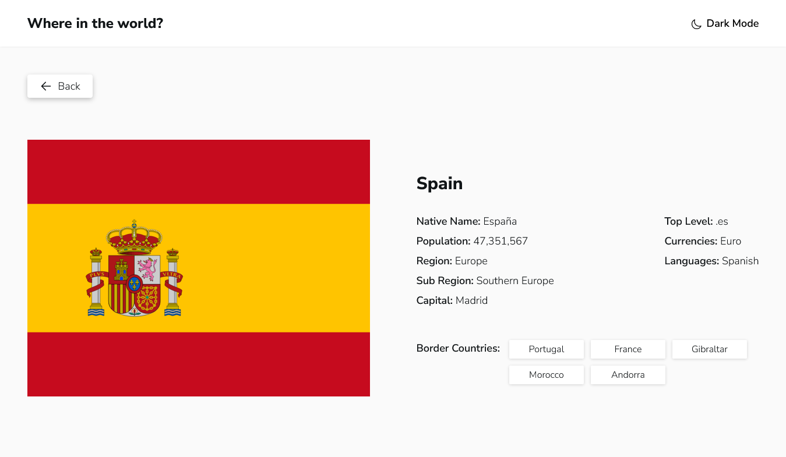

# Frontend Mentor - REST Countries API with color theme switcher solution

This is a solution to the [REST Countries API with color theme switcher challenge on Frontend Mentor](https://www.frontendmentor.io/challenges/rest-countries-api-with-color-theme-switcher-5cacc469fec04111f7b848ca). Frontend Mentor challenges help you improve your coding skills by building realistic projects. 

## Table of contents

- [Overview](#overview)
  - [The challenge](#the-challenge)
  - [Screenshot](#screenshot)
  - [Links](#links)
- [My process](#my-process)
  - [Built with](#built-with)
  - [What I learned](#what-i-learned)
  - [Continued development](#continued-development)
- [Author](#author)


## Overview

### The challenge

Users should be able to:

- See all countries from the API on the homepage
- Search for a country using an `input` field
- Filter countries by region
- Click on a country to see more detailed information on a separate page
- Click through to the border countries on the detail page
- Toggle the color scheme between light and dark mode *(optional)*

### Screenshot




### Links

- Solution URL: [Repo](https://github.com/arey-dev/rest-country)
- Live Site URL: [Github Pages](https://arey-dev.github.io/rest-country/)

## My process

### Built with

- Mobile-first workflow
- [React](https://reactjs.org/) - JS library
- [React Router](https://reactrouter.com/en/main) - For Client Side Routing
- [Tailwind CSS](https://tailwindcss.com/) - For styles

### What I learned

During this project, I got to use my knowledge in React Router and Tailwind CSS. I used almost everything I learned in tutorial section of React Router. Routing could be confusing at first but it gets fun as you understand the concepts little by little while doing a project.

```js
export const router = createBrowserRouter([
  {
    path: "/",
    element: <Root />,
    errorElement: <ErrorPage />,
    children: [
      {
        errorElement: <ErrorPage />,
        children: [
          {
            index: true,
            element: <Home />,
            loader: countriesLoader,
          },
          {
            path: "/detail/:id",
            element: <CountryDetail />,
            loader: countryLoader,
          },
        ],
      },
    ],
  },
]);
```

I know this is not much, but I enjoyed my self in the process.


### Continued development

I want to do more projects where I'm gonna learn a lot while doing. I'm going to learn TypeScript and a little bit of backend technology like Firebase. 

## Author

- Frontend Mentor - [@arey-dev](https://www.frontendmentor.io/profile/arey-dev)
- github - [arey-dev](https://github.com/arey-dev)
